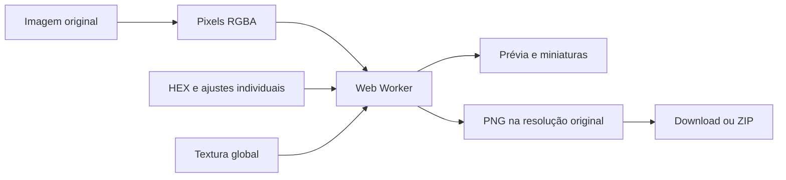
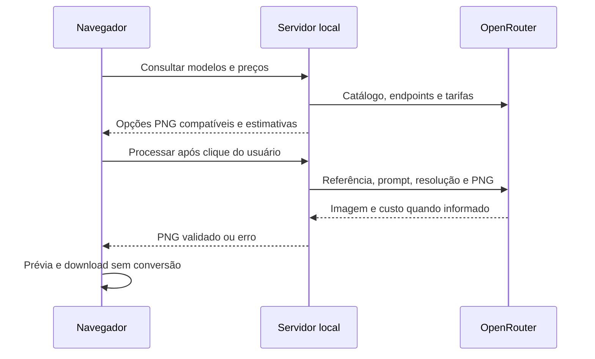

# Arquitetura e manutenção

[README](../README.md) · [Uso](guia-de-uso.md) · [API e OpenRouter](openrouter.md)

## Organização

Aplicação em HTML, CSS e JavaScript sem framework, build ou dependências de produção. O servidor usa módulos nativos do Node.js e `fetch`. As telas mantêm sessões independentes na memória do navegador.

| Arquivo | Responsabilidade |
| --- | --- |
| `index.html` | Estrutura do estúdio de cores |
| `studio.js` | Upload, variantes, worker, inspeção, exportação e estado |
| `color-engine.js` | HEX, sRGB/Oklab, análise e recoloração |
| `batch-model.js` | Lista de cores, parâmetros individuais e nomes seguros |
| `zip-store.js` | ZIP sem compressão adicional, CRC32 e nomes UTF-8 |
| `sample.js` | Amostra embutida para uso sem rede |
| `viewer.js` | Classe `FabricViewer`: zoom, arraste, toque e atalhos |
| `styles.css`, `inspection.css`, `batch.css` | Estilos do estúdio, inspeção e lotes |
| `upscale.html`, `upscale.css` | Interface da tela de IA |
| `upscale.js` | Upload, catálogo, preços, requisição, prévias e download |
| `server.cjs` | HTTP local, arquivos permitidos e rotas `/api/ai/*` |
| `openrouter.cjs` | Capacidades, preços, geração e validações da integração |
| `tests/` | Testes Node e fixture com transparência |
| `design/` | Referências visuais e capturas históricas |

## Recoloração



`studio.js` cria um Worker a partir de um Blob contendo `ColorEngineFactory`. As chamadas têm identificadores e transferem buffers. Revisões evitam que uma resposta antiga substitua a prévia atual. Miniaturas usam fonte reduzida; exportações usam a fonte completa.

O motor converte sRGB para luz linear e Oklab. Analisa a luminosidade por pixel e a mediana ponderada por alpha. A cor-alvo ancora luminosidade e cromaticidade; diferenças de luz mantêm a textura, com compressão suave nos extremos. O croma é reduzido para respeitar o gamut sRGB. Uma tabela de 8.192 entradas acelera a aplicação.

Cada recoloração parte da origem. Alpha é preservado e pixels totalmente transparentes não participam da mediana. Em imagens texturizadas, preto e branco extremos recebem uma pequena margem de luminosidade, sinalizada pela interface. O processamento não segmenta objetos nem simula tecido físico.

Matrizes Oklab: [Björn Ottosson](https://bottosson.github.io/posts/oklab/).

## Exportação e câmera

A exportação captura os parâmetros, processa uma versão por vez e bloqueia alterações durante a preparação. O limite de tamanho é conferido ao produzir cada PNG. `ZipStore` armazena os bytes sem nova compressão.

`FabricViewer` altera a apresentação por CSS, sem reamostrar os arquivos. O estúdio compartilha uma câmera na comparação; o upscale cria uma por prévia. Controles sem imagem ficam desabilitados. Mudanças nesse componente devem ser verificadas nas duas telas.

## Integração IA



O upload fica local até o processamento. A entrada é preparada como PNG em canvas sem mudar dimensões. O servidor valida a entrada, confirma o endpoint e envia uma chamada de geração. A resposta deve ter assinatura PNG. O navegador confere MIME e decodifica a imagem antes de liberar o download. Não há conversão do resultado.

`createOpenRouter({apiKey, fetchImpl})` permite injetar chave fictícia e transporte simulado. `createServer(options)` repassa essas opções. Os testes usam portas efêmeras, sem depender do servidor diário.

## Configuração e segurança

| Variável | Uso | Padrão |
| --- | --- | --- |
| `OPENROUTER_API_KEY` | Credencial do servidor | Ausente; catálogo informa `configured: false` |
| `PORT` | Porta ao executar `server.cjs` | `4173` |

Não há carregamento automático de `.env`, banco de dados, autenticação multiusuário ou persistência de imagens no servidor. A chave não é enviada ao navegador. Erros externos são traduzidos sem repassar o corpo bruto do provedor.

O servidor escuta em `127.0.0.1`, valida `Host`, verifica origem da API e exige cabeçalho próprio para gerar. Publica somente a lista `assets`; servidor, `.git`, testes e documentação não ficam disponíveis via HTTP. Ao adicionar um recurso de interface, atualize a lista e o MIME se necessário.

Essas medidas atendem ao uso local. Implantação pública exigiria autenticação, autorização, gestão de chaves e limites por usuário.

O corpo JSON aceita até 56 MiB para acomodar base64. A resposta remota tem limite de 150 MiB de JSON e 140 MiB na string base64 da imagem. Limites de transporte não equivalem aos limites de pixels da entrada.

## Verificação

Execute na raiz:

```powershell
node --test tests/*.test.cjs
node --check studio.js
node --check viewer.js
node --check upscale.js
node --check openrouter.cjs
node --check server.cjs
```

| Suíte | Cobertura |
| --- | --- |
| `tests/color.test.cjs` | HEX, conversões, cor uniforme, neutralidade, ordem tonal, alpha e extremos |
| `tests/batch.test.cjs` | Lista atômica, ajustes, textura, nomes e ZIP |
| `tests/openrouter.test.cjs` | PNG e endpoint, resolução, payload, chave, origem, limites, concorrência, erros e preços |

Os testes usam respostas simuladas e não consomem créditos. Eles não demonstram fidelidade visual de um modelo. Não há runner de navegador ou dependência Playwright instalada no repositório.

### Roteiro manual

1. Envie imagem com transparência ao estúdio, adicione três HEX e confira a rejeição de lista inválida.
2. Altere ajustes individuais e textura; troque a origem e confira que a paleta permanece.
3. Confira as visualizações, zoom, percentual, roda, arraste, teclado e toque nas duas telas.
4. Exporte PNG e ZIP. Confira nomes, quantidade, dimensões e transparência; cancele um lote em preparação.
5. Consulte catálogo e preços na IA sem gerar. Confira o botão de download inicialmente visível e desabilitado.
6. Em ambiente com provedor simulado, confira sucesso PNG, rejeição de outro formato, cancelamento, falha, bloqueio durante espera e limpeza após novo upload.
7. Confira desktop e largura de 390 px sem rolagem horizontal indevida nem erros no console.

### Pontos de manutenção

| Mudança | Local |
| --- | --- |
| Prompt 2K/4K | Corpo de `upscale` em `openrouter.cjs` |
| Modelos e provedores | `acceptsPng`, `compatibleEndpoint`, `models`, `endpointFor` |
| Preços | `estimatePrice`, `pricing` e apresentação em `upscale.js` |
| Limites de entrada | `studio.js`, `upscale.js` e `inputImage` |
| Zoom | `viewer.js` e estilos |
| Nomes de cores | `batch-model.js` |
| Rotas e arquivos públicos | `server.cjs` |

Mantenha validações do navegador e servidor coerentes. Referência, PNG e resolução devem existir no mesmo endpoint, também para consulta de preço. Reinicie o servidor após mudar `.cjs`; atualize a aba após mudar a interface.
